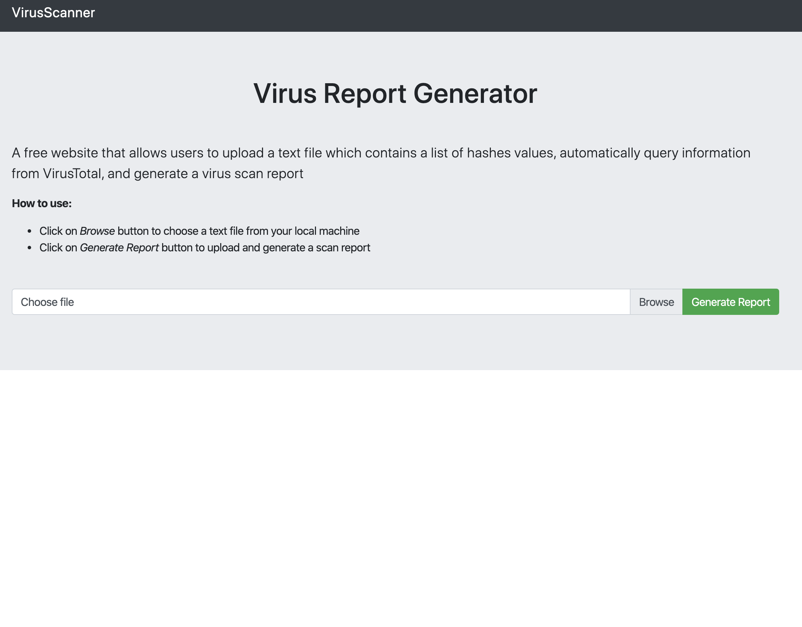
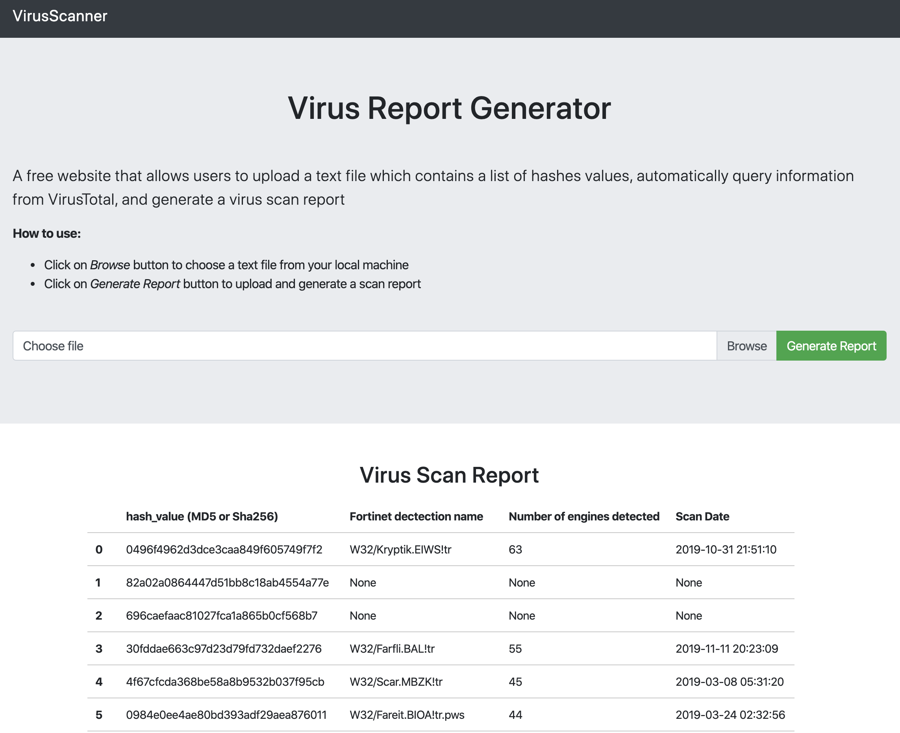
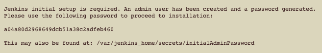
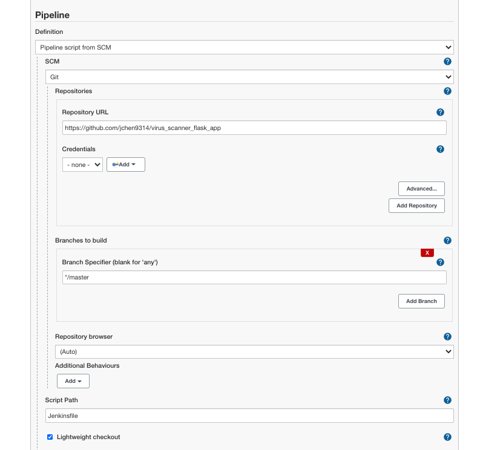
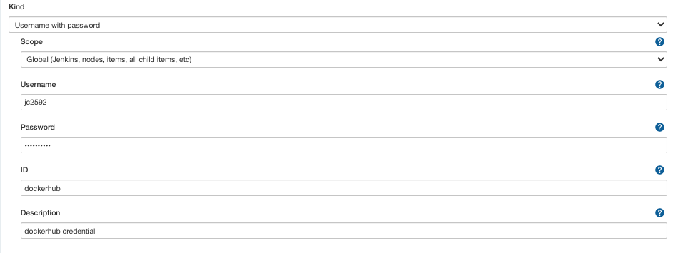
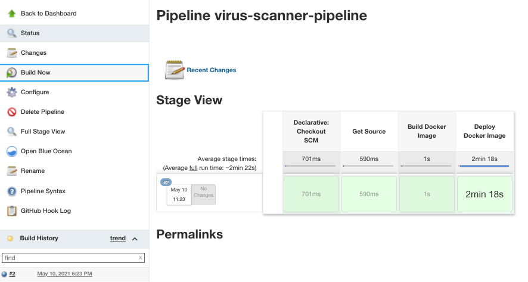

# VirusScanner

**PLEASE READ BEFORE USING THE APP**

## Project summary

VirusScanner is a web application that is generated using the Python Flask Framework. It allows users to upload a text file as a list of hashes (MD5 or Sha256) and generates a simple report using
information provided by querying VirusTotal's public API for the scan report of the hashes.

This repo provides instructions on how to run this website on your local machine, dockerize the application, as well as deploy the app with AWS ElasticBeanstalk.

## Repo structure

```bash
    fortinet_assignment/
├── application.py        
├── Dockerfile           
├── README.md
├── requirements.txt       
├── static
    ├── style.css         
├── templates
    ├── base.html
    └── results.html       # it will display the generated report
```

The following is the description of each file in detail.

- __application.py__: A python script for running this app and it contains the following functions:
	- __query\_api__: it queries VirusTotal's Public API based on a given hash value
	- __retrieve\_report__: it reads uploaded file and generates a report as a pandas dataframe.
	- __upload\_generate\_report__: it allows users to upload a text file once a time and automatically render a query report.
- __Dockerfile__: A recipe to build a Docker image for this project
- __requirements.txt__: A text file that contains names of all necessary python packages
- __static/style.css__: A CSS file that is used to format the generated report
- __templates__: 2 HTML files that are used to build the website structure

_Note_: You may use your API key to retrieve information from VirusTotal's API.
To do this, you may register [here](https://www.virustotal.com/gui/join-us) and replace the provided key with yours by changing one line of code in application.py.

```
API_KEY = YOUR_OWN_API_KEY
```

## Quickstart

This section explains how to run this project on your local machine. The following commands have been tested on Ubuntu 18.04.

### Step 1: Obtain the source code

First, download the source code for this application from Gitlab by typing the following code in Terminal:

```
git clone https://github.com/jchen9314/virus_scanner_flask_app.git
```

After that, navigate to the `virus_scanner_flask_app` folder:

```
cd virus_scanner_flask_app
```

### Step 2: Set up software and environment on a local machine

Set up your Python3 properly:

```
# update and upgrade the system
sudo apt-get -y upgrade

# check your python3 version
python3 --version
```

To manage software packages for Python, let’s install `pip`:

```
sudo apt-get install -y python3-pip
```

Create a virtual environment by typing:

```
sudo apt-get install -y python3-venv
```

Give your virtual environment a name:

```
# I will use `flask-env` as the environment name
python3 -m venv flask-env
```

Activate your virtual environment:

```
source flask-env/bin/activate
```

Install the necessary packages in requirements.txt:

```
pip3 install -r requirements.txt
```

### Step 3: Launch the app

Launch the app: 

```
python3 application.py
```

The app can be opened in the local machine by clicking on [this link](http://0.0.0.0:5000/).

Once you have finished doing the analysis, hit `CTRL+C` to quit the app in the command line.

To deactivate your virtual environment:

```
deactivate
```

## How to use this app

This section explains how to use this application.

Step 1. Click the `Browse` button to choose a text file.



Step 2. Click the `Generate Report` button to upload and generate a query report. The report displays at the bottom of the screen.



## Technology stack

- OS: Ubuntu 18.04
- Language: Python 3.6.9 and above
- Docker Container: Docker 19.03.5
- AWS Elastic Beanstalk: EB CLI 3.16.0

## Dependencies

Python packages:

- Flask==1.1.2
- Jinja2==2.11.3
- numpy==1.20.2
- pandas==1.2.4
- requests==2.25.1
- Werkzeug==1.0.1
- gevent==21.1.2

## Dockerize the application

Step 1: Write a Dockerfile and build a customized docker image (`ft-flask`) for this project by typing:

```
docker build -t ft-flask:latest .

# check if the image is complete
docker images
```

Step 2: Run our app inside the container that is running the image:

```
docker run -d -p 5000:5000 --name flask-container ft-flask
```

Step 3: Check the running process and browse [this link](http://0.0.0.0:5000/):

```
docker ps
```

Note: 

- You may need to install a ubuntu image before building `ft-flask`. You may use the following command to download the ubuntu image from docker hub:

	```
	docker pull ubuntu
	```

- If you don't have Docker installed on your machine, you need to install it by typing the following commands before building the docker image:

	```
	# install docker
	sudo apt install docker.io
	
	# start and automatic docker
	sudo systemctl start docker
	sudo systemctl enable docker
	```
### Build CI/CD pipeline with Jenkins

Here I will use docker-compose.yml to launch Jenkins image. The difference between Dockerfile and docker compose is that Dockerfile is a text file that consists of commands a user could call to build a docker image whereas docker compose is a tool connecting and running multiple containers/microservices.

Step 1: Launch Jenkins image:

```
docker-compose up
```

Step 2: Initialize Jenkins plugins

- Click [here](http://127.0.0.1:8081/) to open Jenkins

- Login using the password shown in your Terminal like the image below



- Click Install suggested plugins

- Create admin user and launch the Jenkins dashboard

- Set up Docker in Jenkins

1. Add docker plugin: click Manage Jenkins, and click Manange Plugins; inside plugin manager, click Available tab and search for Docker Pipeline, docker-build-step, CloudBees Docker Build and Publish plugin and install them.

2. Back to dashboard, click Global Tool Configuration and scroll down to Docker, give a Docker name like myDocker and click Install automatically and Save.

Step 3: Build a pipeline:

This pipeline will contain three 3 steps: getting source from github repository, building a docker image and deploying it to Docker Hub.

- Click New Item on the dashboard, enter an item name like <i>virus-scanner-pipeline</i> and select Pipeline

- Follow the image below to configure your pipeline



- To push the image to Docker, we need to store Docker Hub credential in Jenkins

1. Go to Manage Jenkins, select Manage Credentials, click Jenkins inside the table <i>Stores scoped to Jenkins</i>, click Global credentials and adding some credentials

2. Fill your docker hub credential in the form and click OK.



3. Go back to Dashboard, click the pipeline and Build Now and you will see the build result shown in the image below.



### Deploy app with AWS Elastic Beanstalk

The followings are steps to deploy the app on AWS.

Step 1: install EB CLI:

```
pip3 install awsebcli --upgrade --user

# check EB version
eb --version
```

Step 2: Activate your virtual environment:

```
source flask-env/bin/activate
```

Step 3: Initialize your EB CLI repo:

```
eb init
```

It will ask you series questions like selecting a region, a platform and its version, etc.

If it's your first time using AWS, it will ask you to provide your credentials (i.e. aws-access-id, aws-secret-key), you may find them by creating an AWS account and then clicking My Security Credential.

Step 4: Create an environment and deploy the application:

```
# environment name: flask-env
eb create flask-env
```

Step 5: Open your website:

```
eb open
```

## Issues

| Issue | Solution |
|---|---|
|The script wasn't able to retrieve any data from VirusTotal and return 'None' all the time. | I found that the Public API is limited to 4 requests per minute, so I add sleep time for the script (`time.sleep(15)`) which means it will stop running for 15 seconds before the next query. In the future, you may need to use Private API to retrieve more data efficiently.|
|I start building the website without testing the query code beforehand and found weird errors that are hard to debug. | I tested the query code and found several typos and then ran the whole app successfully.|
|Terminal often threw `Indentation Error`. |I found that I used both Spaces and Tabs for indentation, so I convert all indentations to Tabs.|
|I wasn't able to test the application on Linux machine|I installed Linux on VirtualBox and successfully tested the application on Ubuntu.|
|I ran the docker image and found `Internal Server Error`| I found that docker use different IP from my localhost and fixed it by listening on all interfaces: 0.0.0.0|
|I ran the application on AWS and found that it throws HTTP 504 Error when uploading a file that has more than 5 hash values.|I tried to fix by increasing `ConnectionSettingIdleTimeout` and it worked for querying 10 values but still cannot be able to query more hash values which might be the result of using the Free Tier AWS EC2 instance. In the future, you may purchase other instances that have more capacity to handle long queries.|


## Further Development

> 1. The input list could be very large. So users may not be able to wait for the queries to complete, and as such, could not see the report right away. Consider how to let users come back later to see the report.

To let users come back later to see the report, I think we could send users a notification message via email/phone which tells them the queries are finished and the report is ready to be viewed. I would also suggest that we could design a popup window and show it or create a tool that would play a sound after finishing the query.

> 2. Many people might use the website frequently over time. The same hash can be queried multiple times. Consider how to store VirusTotal's results locally so that the website does not need to query the same hash again from VirusTotal if the scan date is less than 1 day ago.

I think we could create a database to store the queried results including the scan date. So, each time an input hash value would be matched with the data inside the database. If the scan date is less than 1 day ago, we could just read information from the database instead of querying the hash from VirusTotal. If the scan date is more than 1 day ago, we could query it and store the new query result and delete the old one.